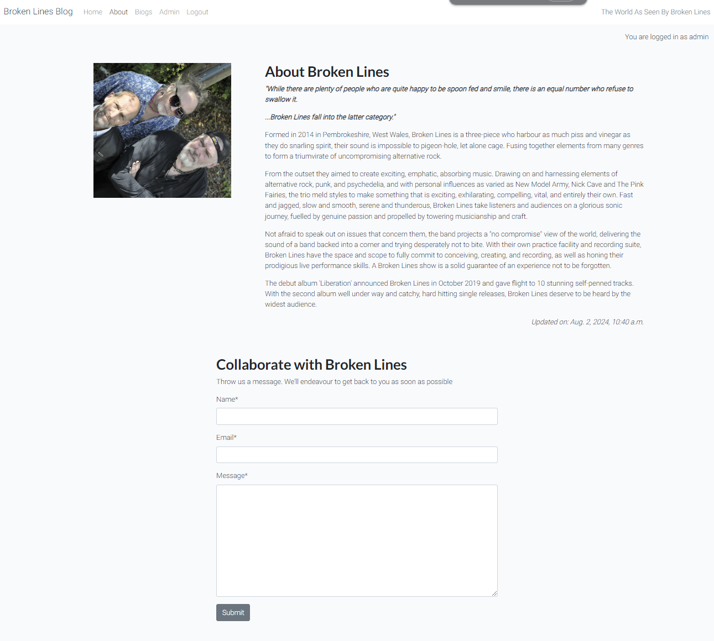

# Broken Lines Blog

This project is to develop a small blog website for the band Broken Lines, as a micro service to enable bnd followerss to keep informed on what hte band is doing and comment and discuss relevant posts.

From a users perspective, they should be able to view posts made by the band, and, if a registered user, comment on those posts to enage in conversation with other users or the band themselves.

In terms of design, a minimalistic approach has been taken in order to let the vibrance of the blg post images dictate the overal feel of the site. should be a cohesive colour scheme and set of styles across the whole site to reiterate the artist's brand. Site layout should enhance rather than impede the user experience to give a welcoming, intuitive feel.

A responsive site layout enables easy navigation on all devices.

## Desktop

## Tablet

## Mobile

## UX Design

### Typography

[**Font Awesome**](https://fontawesome.com) icons were used for the site icons. For example, the social media icons in the footer of the pages.

[**Lato**](https://fonts.google.com/specimen/Lato) was used for the primary headers and titles.

[**Roboto**](https://fonts.google.com/specimen/Roboto) was used for all other secondary text.

### Colour Palette ###

A simple colour palette was chosen to compliment the vibrant images of the band, with a plain white page background, blue icons and a dark gray footer and individual blog page  header background. A simple red was chosen for the link hover to blog pages.

### Home Page Wireframe Design

### Post Detail Page Wireframe Design

### About Page Wireframe Design

### Biog Page Wireframe Design

## User Stories

**As a site user, I can view a list of posts and click on the post I want to view.**

- A list of posts is displayed on the front page
- Multiple posts are listed and paginated

**As a Site User, I can click on a post so that I can read the full text.**

- When a blog post title is clicked, a detailed view of the individual post is displayed.

**As a Site Admin I can create draft posts so that I can finish writing the content later, prior to publishing.**

- As a logged in Admin, they can save a draft blog post
- As a logged in Admin they can finish the content at a later time

**As a Site User I can view comments on an individual post**

- Given one or more user comments the user can view them.
- Given one or more user comments the admin can view them.

**As a Site User I can leave comments on a post**

- Comments need to be approved by an admin user
- Approved comments are listed on the individual post page

**As a Site User I can modify or delete my comments on a post**

- A logged in user can modify their own comments
- A logged in user can delete their own comments

**As a site admin I can approve/disapprove comments in order to filter out objectionable comments**

- Admin can approve a comment
- Admin can un-approve a comment

**As a Site User, I can click on the About link and read about the site.**

- When the About link is clicked, the about page is displayed.

**As a Site Admin, I can create or update the about page.**

- The About app is visible in the admin panel
- The About app is accessible to Admin users

**As a site user I can fill in a contact /collaboration form so that I can submit a message to the site owner.**

- Contact/collaboration form is submitted and feedback given

**As a Site Admin I can mark contact messages as "read".**

- Admin can mark messages as read

**As a user I can click on the biography menu and read the band biography**

- User clicks biography and band biog page displays
- Admin can add/edit band biographies

**As a Site User I can register an account so that I can comment posts.**

- Given an email a user can register an account and log in.
- When the user is logged in they can comment.

**As a site user/admin I can login so that I can access all of available content.**

- User can login and se the full range of available menus.

**As a site user/admin I can logout so that I can leave the site safely.**

- User/admin can logout successfully

The completed sprint was composed of 15 separate items. Having used the MoSCoW approach to prioritisation, 9 were classified as "Must-Have" making up less than 60% of the tasks as recommended. The rest of the first sprint was made up of "Should-Have" and "Could-Have" items.
There were no remaining backlog items.

## Features

  

- **Home Page**

The home page of the site offers the user a grid of blog posts, by the band, that the user can click on to read each individual blog post.

  

- **About Page**

The about page gives details about the band history and offers the option to make a collaboration request, via a form at the bottom of the page. The collaboration request is stored in the database for later review.

  

- **Biogs Page**

The biogs page gives a biographical history of each band member, detailing past experiences in music and previous bands.

- **Navigation Bar**

Navigation is provided via a bootstrap navbar.

And is fully responsive

  
- **The Footer**

The page footer is a simple arrangement of 3 social media icons.

  

- **Sign Up**

The site has a facility to sign up as a user in order to make, edit or delete your own comments on blog posts.

  

- **Sign In**

The site has a facility to sign in, once you have created a user account, in order to make, edit or delete your own comments on blog posts.

  

- **Sign Out**

The site has a facility for a user to sign out of their account.

  

- **Admin**

The site has a facility for designated administrators to sign in, in order to administrate the site via the standard Django admin interface.

  

- **Entity Relationship Diagram**

The following data structure was created for the project.

## Testing

### Manual Testing
The site was tested on the following browsers for compatibility:

### Chrome ###
|   Test	|  Expected Result 	|  Actual Result	|
|---	|---	|---	|
|   Click Home menu	|  success 	|  success 	|
|   Click About menu	|  success 	|  success 	|
|   Click Biogs menu	|  success 	|  success 	|
|   Click Admin menu	|  success 	|  success 	|
|   Click Login menu	|  success 	|  success 	|
|   Click Logout	|  success 	|  success 	|
|   Click individual blog post	|  success 	|  success 	|
|   Create, edit, delete a personal comment	|  success 	|  success 	|
|   Register new account	|  success 	|  success 	|
|   Create collaboration request	|  success 	|  success 	|
|   Access admin interface	|  success 	|  success 	|
|   Responsivity	|  success 	|  success 	|
|   Open new page from social media links	|  success 	|  success 	|

### Firefox ###
|   Test	|  Expected Result 	|  Actual Result	|
|---	|---	|---	|
|   Click Home menu	|  success 	|  success 	|
|   Click About menu	|  success 	|  success 	|
|   Click Biogs menu	|  success 	|  success 	|
|   Click Admin menu	|  success 	|  success 	|
|   Click Login menu	|  success 	|  success 	|
|   Click Logout	|  success 	|  success 	|
|   Click individual blog post	|  success 	|  success 	|
|   Create, edit, delete a personal comment	|  success 	|  success 	|
|   Register new account	|  success 	|  success 	|
|   Create collaboration request	|  success 	|  success 	|
|   Access admin interface	|  success 	|  success 	|
|   Responsivity	|  success 	|  success 	|
|   Open new page from social media links	|  success 	|  success 	|

### Edge ###
|   Test	|  Expected Result 	|  Actual Result	|
|---	|---	|---	|
|   Click Home menu	|  success 	|  success 	|
|   Click About menu	|  success 	|  success 	|
|   Click Biogs menu	|  success 	|  success 	|
|   Click Admin menu	|  success 	|  success 	|
|   Click Login menu	|  success 	|  success 	|
|   Click Logout	|  success 	|  success 	|
|   Click individual blog post	|  success 	|  success 	|
|   Create, edit, delete a personal comment	|  success 	|  success 	|
|   Register new account	|  success 	|  success 	|
|   Create collaboration request	|  success 	|  success 	|
|   Access admin interface	|  success 	|  success 	|
|   Responsivity	|  success 	|  success 	|
|   Open new page from social media links	|  success 	|  success 	|

### Safari ###
|   Test	|  Expected Result 	|  Actual Result	|
|---	|---	|---	|
|   Click Home menu	|  success 	|  success 	|
|   Click About menu	|  success 	|  success 	|
|   Click Biogs menu	|  success 	|  success 	|
|   Click Admin menu	|  success 	|  success 	|
|   Click Login menu	|  success 	|  success 	|
|   Click Logout	|  success 	|  success 	|
|   Click individual blog post	|  success 	|  success 	|
|   Create, edit, delete a personal comment	|  success 	|  success 	|
|   Register new account	|  success 	|  success 	|
|   Create collaboration request	|  success 	|  success 	|
|   Access admin interface	|  success 	|  success 	|
|   Responsivity	|  success 	|  success 	|
|   Open new page from social media links	|  success 	|  success 	|

### Lighthouse
The site was tested using Lighthouse with the following results:

### Responsive Testing

Alongside the built in Bootstrap responsive CSS, Chrome dev tools were used frequently to test the site at standard screen sizes and the site was manually viewed on laptops, tablets and phones.

### Validator Testing

- HTML

  - No errors were returned when passing through the official W3C validator

- CSS
  - No errors were found with our own CSS code when passing through the official Jigsaw validator.

- Python

  - All Python code was tested for PEP8 compatibility with the Code Institute Linter.

  **The only code that didn't pass was code that was automatically generated by Django**
  
  which was then edited in order to pass.

  

  - Javascript

  - All Javascript code was tested for errors with JSHint. There were no code errors and one error related to imported code, which is outside the domain of the test.
  
  

## Deployment

The site was deployed to Heroku from the main branch of the repository early in the development stage for continuous deployment and checking.

The Heroku app is setup with 3 environment variables, repalcing the environment variables stored in env.py (which doesn't get pushed to github).

In order to create an Heroku app:

1. Click on New in the Heroku dashboard, and Create new app from the menu dropdown.

2. Give your new app a unique name, and choose a region, preferably one that is geographically closest to you.

3. Click "Create app"

4. In your app settings, click on "Reveal Config Vars" and add the environment variables for your app. These are:
- DATABASE_URL - your database connection string
- SECRET_Key - the secret key for your app
- CLOUDINARY_URL - the cloudinary url for your image store

The PostgreSQL database is served from ElephantSQL

Once the app setup is complete, click on the Deploy tab and:

1. connect to the required GitHub account
2. select the repository to deploy from
3. click the Deploy Branch button to start the  deployment.
4. Once deployment finishes the app can be launched.

The live link can be found [_here_](https://broken-lines-blog-d7e7160138f2.herokuapp.com/)

## Credits
- This project is based on the "I Think Therefore I Blog" project from the LMS.
  
### Content

- all content is copyright Broken Lines Publishing Limited 2024.
- The posts were created by various members of the band.

### Media

- For this project, all media was supplied by Broken Lines.
